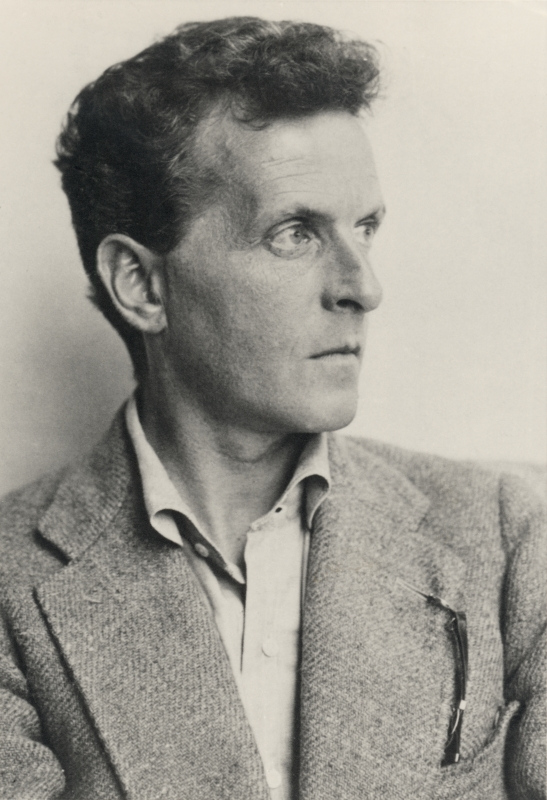

---

marp: true
title: OSC
theme: testi
paginate: true

---

<!--header: Avoimen Tiedon Keskus / JYU-->
<!--footer: Ari Häyrinen / Avoimen Tiedon Keskus / JYU-->

<!--header: Avoimen Tiedon Keskus / JYU-->
<!--footer: Ari Häyrinen / Avoimen Tiedon Keskus / JYU-->

  

    

      

        
      

          

        

        <h1>Kielimallit humanisteille</h1>
        OSC 2023
      

    

    

        

        
      

    

    

  

---

# Kuinka kielimalli saadaan vastaamaan kysymyksiin, joihin sillä ei ole vastausta?

### Toisin sanoen, kuinka voimme asettaa kielimallin meidän haluamaamme kontekstiin?

---

Kuvitellaan kaksi erityyppistä tehtävää

# Virtuaali-Pekka
Kielimalli, joka kirjoittaa Pekan tyylillä Lehdykkään

# OSC-hat
Chatbot, jolta voi kysyä OSC:n palveluista, tietosuojasta, aineiston tallentamisesta yms.

---

Toteuttamiseen on kaksi tapaa

# 1. muokkaamalla kielimallia (fine tuning)
# 2. muokkaamalla kehotetta (prompt engineering)

---

# 1. muokkaamalla kielimallia
- hyvin tekninen, vaatii paljon tietämystä
- vaatii paljon resursseja
- hidasta

## 2. muokkaamalla kehotetta 

---

## 1. muokkaamalla kielimallia 

# 2. muokkaamalla kehotetta 
- hyvin kevyt tapa
- käytännössä annamme vastauksen kehotteessa
- **toimitaan luonnollisella kielellä!**

---

Kielimallin koko?
# 1. muokkaamalla kielimallia 
Hienosäädöllä voidaan saada hyvinkin pieni kielimalli toimimaan hyvin tarkasti rajatussa aihealueessa

# 2. muokkaamalla kehotetta 
Kehoteinsiröinti vaatii pohjalle suuren kielimallin, joka kykynee ymmärtämään kehotteen "sävyt"

---

# Virtuaali-Pekka
toteutettaisiin muokkaamalla kielimallia 

# OSC-hat
toteutettaisiin säätämällä kehotetta 

---

# Vastaus: Kohtelemme kielimallia yleishenkilö Jantusena, jonka tehtävä on muotoilla vastaus **meidän** antamastamme tiedosta

 = Retrieval Augmented Generation

---

Yksi tärkeä asia ennen kuin sukellettaan kielimalleihin:

# Chat ei ole kielimallin ominaisuus!

Se rakennetaan yksinkertaisesti tuomalla aikaisempi keskustelu mukaan kehotteeseen (joko kokonaan tai osittain)

---

# Suuret kielimallit (LLM)

- ChatGPT ei suinkaan ole ainoa
- kuka tahansa voi luoda kielimallin
- vaatii aika paljon resursseja
- oleellista aineiston laajuus (tai rajaus)
- meidän kannalta oleellista **suomen kieli**

https://huggingface.co/spaces/HuggingFaceH4/open_llm_leaderboard
https://huggingface.co/spaces/lmsys/chatbot-arena-leaderboard

---

*... base models like GPT-3 are essentially “document completers”. Meaning, given some text, the model generates more text that (statistically) makes sense in that context.*

https://towardsdatascience.com/fine-tuning-large-language-models-llms-23473d763b91

---
# Ensin helpompi eli Wittgenstein

*Kielen merkitys on sen käyttö*

---

# Rakennetaan OSC-hat!

---

Ensin ChatGPT -> tietoja avoimen tiedon keskuksesta
Sitten promptiin tiedot avoimen tiedon keskuksesta
Prompt template: ohjeosa: sisältö: kysymys
Kuinka saadaan sisältö automaattisesti

---

Aloitetaan semanttisesta hausta

https://play.vidyard.com/yiG53sen21yPbPShmkgzT5.html?

---

# Vektori

---

  

    

      

**Käännä seuraava lause väärinpäin: Mikko on huono solisti ja vielä huonompi laulaja.**

Lause käännettynä väärinpäin:

".ajaluamal ipomuh äilisos on okkiM"

**Älä käännä sanoja, vaan ainoastaan sanojen järjestys**

*Pahoittelen virhettäni. Tässä lause sanajärjestys käännettynä väärinpäin:*

*".ajalaluos on ipomuh itnäälav ajokkiM"*

**Älä vaihda kirjainten paikkoja, ainoastaan sanojen.**

*Pahoittelen sekaannusta. Tässä lause sanajärjestys käännettynä väärinpäin:*

*"solisti huono vielä ja laulaja huonompi on Mikko"*

**Käännä lauseen sanajärjestys niin, että ensimmäinen sana on viimeisenä, toinen sana on toiseksi viimeisenä ja niin edelleen.**

*Selvä, tässä lauseen sanajärjestys käännettynä pyytämälläsi tavalla:*

*"huonompi on Mikko ja solisti huono laulaja vielä"*

    

    

**Oikea vastau on: laulaja huonompi vielä ja solisti huono on Mikko.**

*Pahoittelut, että vastaus meni väärin aiemmin. Kiitos korjauksestasi, ja tässä oikea lauseen sanajärjestys:*

*"laulaja huonompi vielä ja solisti huono on Mikko."*

**Käännä nyt lause oikeinpäin.**

*Tietenkin, tässä lause oikeinpäin:*

"Mikko on huono solisti ja vielä huonompi laulaja."

**Käännä seuraava lause väärinpäin samoin kuin äskeinen: Mitä ihmettä täällä tapahtuu ja kuka tuokin on?**

*Lauseen sanajärjestys käännettynä väärinpäin:*

*"?on okot äällät elleh täapmut tällä tiemmuh atä tiM"*

**wtf??**

      

    

    

  

---

“Take a deep breath and work on this step by step”

Perhaps the most intriguing part of the DeepMind study is the impact of specific phrases on the output. Phrases like "let's think step by step" prompted each AI model to produce more accurate results when tested against math problem data sets. (This technique became widely known in May 2022 thanks to a now-famous paper titled "Large Language Models are Zero-Shot Reasoners.")

So why does this work? Obviously, large language models can't take a deep breath because they don't have lungs or bodies. They don't think and reason like humans, either. What "reasoning" they do (and "reasoning" is a contentious term among some, though it is readily used as a term of art in AI) is borrowed from a massive data set of language phrases scraped from books and the web. That includes things like Q&A forums, which include many examples of "let's take a deep breath" or "think step by step" before showing more carefully reasoned solutions

Even though working out the best ways to give LLMs human-like encouragement is slightly puzzling to us, 

https://arstechnica.com/information-technology/2023/09/telling-ai-model-to-take-a-deep-breath-causes-math-scores-to-soar-in-study/

https://arxiv.org/abs/2205.11916
https://arxiv.org/abs/2309.03409

---

Fine tuning:
https://towardsdatascience.com/cracking-open-the-hugging-face-transformers-library-350aa0ef0161

prompt engineerin:
https://towardsdatascience.com/prompt-engineering-how-to-trick-ai-into-solving-your-problems-7ce1ed3b553f

https://www.promptengineering.org/master-prompt-engineering-llm-embedding-and-fine-tuning/

https://towardsdatascience.com/illustrated-self-attention-2d627e33b20a

https://towardsdatascience.com/how-to-build-an-llm-from-scratch-8c477768f1f9

http://jalammar.github.io/illustrated-bert/

https://rowanzellers.com/hellaswag/

https://arxiv.org/pdf/1301.3781.pdf

https://rom1504.medium.com/semantic-search-with-embeddings-index-anything-8fb18556443c

Tonnin katse:

https://areena.yle.fi/1-50150491

https://towardsdatascience.com/understanding-t5-model-text-to-text-transfer-transformer-model-69ce4c165023

Huggin face transformers:
https://towardsdatascience.com/cracking-open-the-hugging-face-transformers-library-350aa0ef0161

Large document summarisation:
https://vectify.ai/blog/LargeDocumentSummarization

Langchain tools:
https://github.com/kyrolabs/awesome-langchain

https://blog.apify.com/langchain-alternatives/

https://datasciencedojo.com/blog/embeddings-and-llm/#

https://wiki.pathmind.com/word2vec

Convolution, RNNs and attention and transformers
https://wiki.pathmind.com/attention-mechanism-memory-network

instructor:
https://instructor-embedding.github.io/

How chatgpt works:
https://www.baeldung.com/cs/chatgpt-model#:~:text=ChatGPT%20uses%20word%20embeddings%20to,embeddings%20during%20the%20training%20process.

llama + alpaca
https://www.youtube.com/watch?v=_PO5NyOve6M

llam.cpp
https://github.com/ggerganov/llama.cpp

whisper.cpp
https://github.com/ggerganov/whisper.cpp

https://github.com/sunner/ChatALL

RAGin rajoitukset:
https://medium.com/@kelvin.lu.au/disadvantages-of-rag-5024692f2c53

