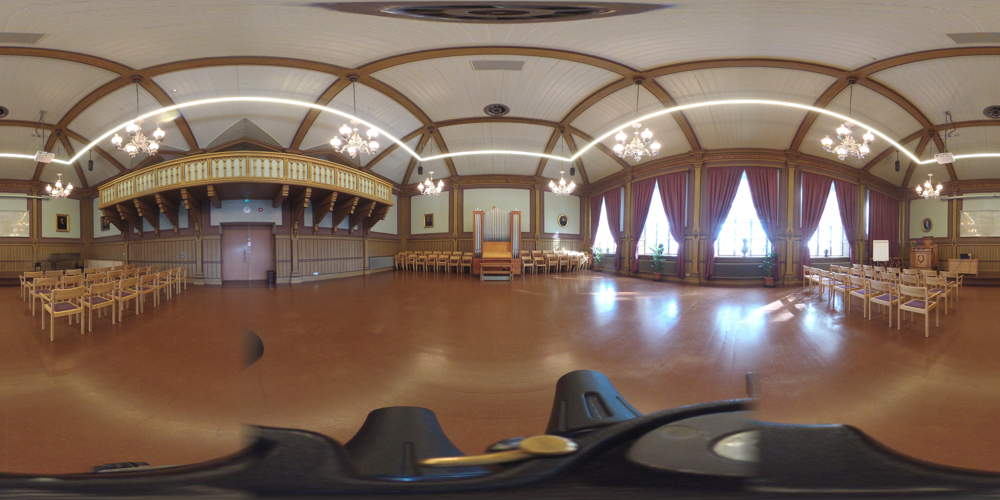

<!--header: Avoimen Tiedon Keskus / JYU-->
<!--footer: Ari Häyrinen / Avoimen Tiedon Keskus / JYU-->

  

    

      

            <h1>Tilan virtualisointi</h1>
            "Yksi tila mukaan, kiitos"
            <h1>Kevyt johdatus koneoppimiseen</h1>
            dystopia, utopia vai uusi arki?
      

    

    

      

        
      

    

        
      

    

  

---
# Tilan virtualisoinnin tekniikat
 ## 360 -kuvaus
 ## photogrammetria
 ## 3D -mallinnus

---
<!--header: Tilan virtualisointi-->
# 360 kuvaus

kuvataan joka suuntaan yhtäaikaa (360 astetta). Stitching -vaiheen jälkeen tuloksena yksi kuva (tai video).

- nopea tapa "vangita" ympäristö
- helppo tapa nauhoittaa tapahtuma
-- muisteluhetki
-- työmaadokumentointi yms.

---
# 360 -aineisto selaimessa

https://tools.oscapps.jyu.fi/public/osc-360-dev/
https://tools.oscapps.jyu.fi/public/kuoma/2019/

---
# 360 -aineisto VR:ssä
- VR-laseilla voidaan tarjota vahva tunne tilassa olemisesta
- "Pallokuvia" voidaan sijoittaa virtuaalitiloihin

https://hubs.mozilla.com/3wkshHE/steel-firsthand-meet

---
# 360 -aineisto
## huonoja puolia
- tiedostokoot ovat hyvin suuria, varsinkin videoissa
- katselu vaatii aina sopivan ohjelmiston

---
# Photogrammetria
3-ulotteiseta kohteesta luodaan  3-ulotteinen malli valokuvien avulla
- voidaan käyttää myös laajoihin alueisiin (kuvataan dronella)

### Karjasillan kirkko
https://hubs.mozilla.com/vjpXfuH/karjasillan-kirkko

---
# Photogrammetria
## etuja
- kuvat itsessään ovat dokumentteja
- kuvista voidaa myöhemmin tekniikan kehittyessä generoida tarkempia malleja
## haittoja
- kuvat-aineisto suuri ja säilyttäminen maksaa

---
# 3D-skannaus
Nopea tapa tuottaa 3D-malli esineestä tai tilasta
- Hyvät skannerit kalliita
- Tarkkuus paljon parempi kuin photogrammetrialla

https://www.dynamism.com/einscan-h.html?aff=4

---
# 3D-mallinnus

Hidasta ja kallista
- Kohteet joita ei enää ole tai joihin ei pääse
- Virtuaaliset rekonstruktiot

https://www.youtube.com/watch?v=B5McKN5YP-o
[Petäjäveden vanhan kirkon ]https://jyx.jyu.fi/bitstream/handle/123456789/38974/building_the_past.pdf?sequence=5&isAllowed=y

---
<!--header: Koneoppiminen-->
# Koneoppiminen

## Dystopia, utopia ja uusi arki

---
# Uusi arki
- asiasanoittaminen
https://annif.org/
- kuvateksti
https://huggingface.co/nlpconnect/vit-gpt2-image-captioning
- objektien tunnistus kuvasta
https://huggingface.co/hustvl/yolos-tiny

---
# Ohjattu koneoppiminen

Kone oppii aineistoista, jotka on luokiteltu ihmisen toimesta

demo:
https://teachablemachine.withgoogle.com/

---
# Generatiivinen AI
### Dystopioiden ja utopioiden rakennusaineistoa!

Koneoppimismallit jotka luovat uutta aineistoa.

A dog by Edvard Munch (stable diffusion)

---
# Kumman valitset?

