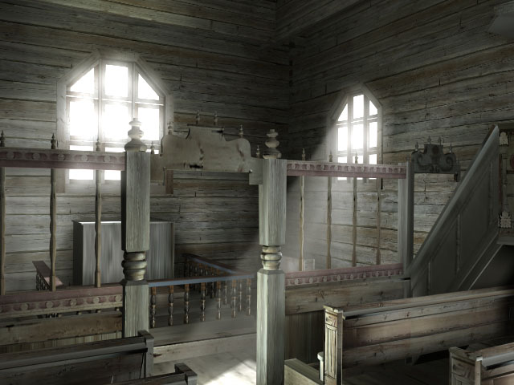

<!--header: Avoimen Tiedon Keskus / JYU-->
<!--footer: Ari Häyrinen / Avoimen Tiedon Keskus / JYU-->

# Museosta tiedon puutarhuriksi

## Aineistojen avaaminen, vuorovaikutus ja museon rooli

  

    

      

            <li>"Avoin aineisto"?</li>
            <li>Lisenssit</li>
            <li>Wikimaailma avoimuuden alustana</li>
      

    

    

      

        
      

    

  

kuva: [Jyväskylän yliopiston museo](https://commons.wikimedia.org/wiki/File:DUO_K1759_25_Puutarhatyo_Miesopiskelijoita_kasvitarhassa.jpeg)  väritys: Ari Häyrinen, DeOldify

---

# Tavoitteet

- Ymmärrät mitä aineiston avoimuus tarkoittaa
- Osaat perustella aineistojen avaamista
- Tiedät miten lähteä liikkeelle aineistojen avaamisen kanssa
- Ymmärrät vapaan lisenssoinnin käytänteet
- Tunnet wikipedian, wikimedia commons ja wikidatan mahdollisuudet
- Sinulla on käsitys, miten aineistojen käyttöä on mahdollista seurata
- **Ymmärrät museoiden mahdollisuudet avoimen tiedon tuottajina "suuressa kuvassa"**

---

# Ari Häyrinen

  

    

      

            <li>tietojärjestelmäasiantuntija  Avoimen tiedon keskuksessa</li>
            <li>humanistitausta: filosofia->taidehistoria->digitaalinen kulttuuri</li>
            <li>https://github.com/artturimatias
      

    

    

      

        
      

      
    

  

kuva: Petäjäveden vanhan kirkon [virtuaalirekonstruktio](https://jyx.jyu.fi/bitstream/handle/123456789/38974/building_the_past.pdf?sequence=5&isAllowed=y)

----

# Mitä tarkoitetaan aineiston avoimuudella?

[opendefinition.org](https://opendefinition.org/od/1.1/fi/)

---

# Avoimuus toisin sanoin

”Mr. Dibbits of the Rijksmuseum maintains that letting the public take control of the images is crucial to encouraging people to commune with the collection”

”If they want to have a Vermeer on their toilet paper, I’d rather have a very high-quality image of Vermeer on toilet paper than a very bad reproduction.”

https://www.techdirt.com/articles/20130529/19425723249/amsterdams-rijksmuseum-does-digital-archives-right-hi-res-downloads-suite-online-editing-tools.shtml

----

# Miksi museoiden tulisi avata aineistojaan julkiseen käyttöön?

---

<!--header: Miksi museoiden tulisi avata aineistojaan julkiseen käyttöön?-->

## Kulttuuriperinnön jakaminen 

Museoiden tehtävä on säilyttää ja tutkia kulttuuriperintöä. Avoin julkaiseminen mahdollistaa tämän kulttuuriperinnön jakamisen kaikille kiinnostuneille, mikä edistää yhteiskunnan tietoisuutta historiallisista ja kulttuurisista saavutuksista.

---

## Tutkimuksen edistäminen

Museoiden kokoelmat voivat olla arvokkaita tutkimuksen kohteita eri aloilla, kuten historian, taiteen, arkeologian ja antropologian aloilla. Avoin julkaiseminen mahdollistaa tutkijoiden, opiskelijoiden ja harrastajien pääsyn näihin kokoelmiin, jolloin he voivat tutkia niitä ja hyödyntää niitä tutkimuksessaan.

---

## Uusien kohdeyleisöjen saavuttaminen

Museot voivat houkutella uusia kävijöitä avaamalla aineistojaan julkiseen käyttöön. Tällöin museot voivat tavoittaa laajemman yleisön, joka ei välttämättä kävisi paikan päällä.

---

## Digitaalisen teknologian hyödyntäminen

 Nykypäivänä digitaalisen teknologian avulla voidaan luoda interaktiivisia ja kiinnostavia verkkosivustoja ja sovelluksia, jotka hyödyntävät museoiden aineistoja. Tämä voi lisätä kävijöiden osallistumista ja kiinnostusta museoiden kokoelmiin.

---

## Kulttuuriperinnön suojeleminen

 Avoimuus voi edistää kulttuuriperinnön suojelua ja säilyttämistä. Kun museoiden kokoelmat ovat julkisesti saatavilla, ihmiset voivat auttaa museoita tunnistamaan ja suojelemaan aineistojaan paremmin.

---

Näistä syistä museoiden kannattaa harkita aineistojensa avaamista julkiseen käyttöön. Samalla avoimuus voi edistää museoiden tärkeintä tehtävää: kulttuuriperinnön säilyttämistä ja jakamista tuleville sukupolville.

Terveisin chatGPT*
*diat 7-12

---

---

<!--header: Lisenssointi-->

# Lisenssointi

- lisenssi kertoo, mitä aineistolla voi tehdä
- lisenssi ja tekijänoikeus ovat eri asioita
- **lisenssi on peruuttamaton!**

[CC-lisenssit](https://creativecommons.org/licenses/)

---

<!--header: Avoimen tiedon puutarhuri?-->

# Avoimen tiedon puutarhuri?

## Entä jos ajattelemme, että haluamme "huoltaa" avointa tietoa myös museon ulkopuolella?

Eli arvokas tieto tai aineisto ei ole vain sitä, mitä meidän kokoelmissa on, vaan kaikki siihen liittyvä tieto on "meidän".

Wikimedia Foundationin -alustat (jatkossa wikimaailma)  on tapa tuoda tietoa yhteen erilaisista lähteistä.

---

<!--header: Wikimaailma-->

# Wikipedia

**Wikipedia** on ainut päivittyvä, suomenkielinen tietosanakirja

- [merkittävyyskriteeri](https://fi.wikipedia.org/wiki/Wikipedia:Merkitt%C3%A4vyys)
- [ei uutta tutkimusta](https://fi.wikipedia.org/wiki/Wikipedia:Ei_uutta_tutkimusta)
- [tiedon oltava lähteistettyä](https://fi.wikipedia.org/wiki/Wikipedia:Merkitse_l%C3%A4hteet) 

Wikipedian [kritiikki](https://fi.wikipedia.org/wiki/Wikipedian_kritiikki)

---

# Wikipedian tilastot

Sivujen ja kieliversioiden katselukerrat ovat seurattavissa

[Käärijä: wipedian katselumäärät](https://pageviews.wmcloud.org/pageviews/?project=fi.wikipedia.org&platform=all-access&agent=user&redirects=0&range=this-year&pages=K%C3%A4%C3%A4rij%C3%A4)

[Uno Cygnaeus: sivun kieliversioiden katselumäärät](https://pageviews.wmcloud.org/langviews/?project=fi.wikipedia.org&platform=all-access&agent=user&range=last-year&sort=views&direction=1&view=list&page=Uno%20Cygnaeus)

---

# Wikidata

**Wikidata** on vapaa, yhteisesti muokattava, monikielinen, toissijainen tietokanta, johon kerätään rakenteista tietoa Wikipedian, Wikimedia Commonsin ja muiden Wikimedia-liikkeen projektien tukemiseen, ja kaikille maailmassa.

[wikidatan esittely](https://www.wikidata.org/wiki/Wikidata:Introduction/fi)

[SPARQL-kysely: Jyväskylän seminaarinmäellä sijaitsevat rakennukset](https://query.wikidata.org/#%0A%23Jyv%C3%A4skyl%C3%A4n%20yliopiston%20rakennukset%0A%0ASELECT%20DISTINCT%20%3Fwid%20%3FwidLabel%20%3FclassLabel%20%3Fclass%0AWHERE%20%0A%7B%0A%0A%20%20%20%20%3Fwid%20wdt%3AP31%20wd%3AQ41176.%0A%09%3Fwid%20wdt%3AP276%20wd%3AQ11892928.%0A%20%20%20%20%3Fwid%20wdt%3AP31%20%3Fclass%20%0A%20%0A%20%20%20%20%09%20%20%20%0A%20%20SERVICE%20wikibase%3Alabel%20%7B%0A%20%20%20%20bd%3AserviceParam%20wikibase%3Alanguage%20%22fi%22%20.%0A%0A%20%20%7D%20%09%20%20%20%0A%7D/)

---

# Wikimedia Commons

**Wikimedia Commons** on mediapankki avoimille mediatiedostoille 

Vain avoimille aineistoille.

### seuranta
[Jyväskylän yliopiston museon kuvien käyttö 2022](https://glamtools.toolforge.org/glamorgan.html?&category=%20%20%20%20%20%20Collections%20of%20the%20Jyv%C3%A4skyl%C3%A4%20University%20Museum&depth=12&year=2022&month=1)

---

# Wikimaailma: Historica -rakennus

[Wikipedia](https://fi.wikipedia.org/wiki/Historica)

[Wikimedia Commons](https://commons.wikimedia.org/wiki/Category:Historica_(Jyv%C3%A4skyl%C3%A4))

[Wikidata](https://www.wikidata.org/wiki/Q28464259)

kuva: [Jyväskylän yliopiston museo](https://commons.wikimedia.org/wiki/Category:Historica_(Jyv%C3%A4skyl%C3%A4)#/media/File:DUO_K1637_2_Postikortti-+seminaarin+naisosaston+rakennukset.jpeg)

---

# Miksi seuranta?

- vaikuttavuusmittarit
- raportointi rahoittajille

---
<!--header: vuorovaiktus-->
# Vuorovaikutus?

## wikityöpajat
https://media-art-finland.fi/wikipaja-mediataiteen-historia-wikipediaan/
https://sateenkaarihistoria.fi/event/sateenkaarihistorian-wikipaja-2022/
https://fi.wikipedia.org/wiki/Wikiprojekti:Keuruun_museo

## hacklabit
[hack4fi](https://hack4.fi/)

---

# Tiedon puutarhuriutta käytännössä

Porin taidemuseon wikidata -projekti

https://www.wikidata.org/wiki/Wikidata:WikiProject_Collection_data_from_Wikidata_to_Finna

---

<!--header: digitaalisen kulttuuriperinnön pelastaminen-->

# Ukrainan digitaalisen kulttuuriperinnön pelastaminen

https://www.sucho.org/

yli 5000 sivustoa arkistoitu ja 50 teratavua aineistoa arkistoitu
